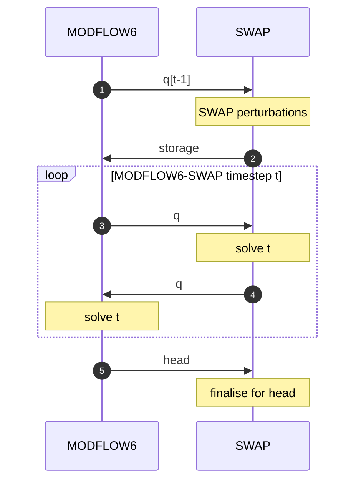

<h3>SwapMod</h3>

```mermaid
sequenceDiagram
    autonumber
    MODFLOW6 ->> SWAP: q[t-1]
    Note over SWAP: SWAP perturbations
    SWAP ->> MODFLOW6: storage
    loop MODFLOW6-SWAP timestep t
        MODFLOW6 ->> SWAP: q
        Note over SWAP: solve t
        SWAP ->> MODFLOW6: q
        Note over MODFLOW6: solve t
    end
    MODFLOW6 ->> SWAP: head
    Note over SWAP: finalise for head
```