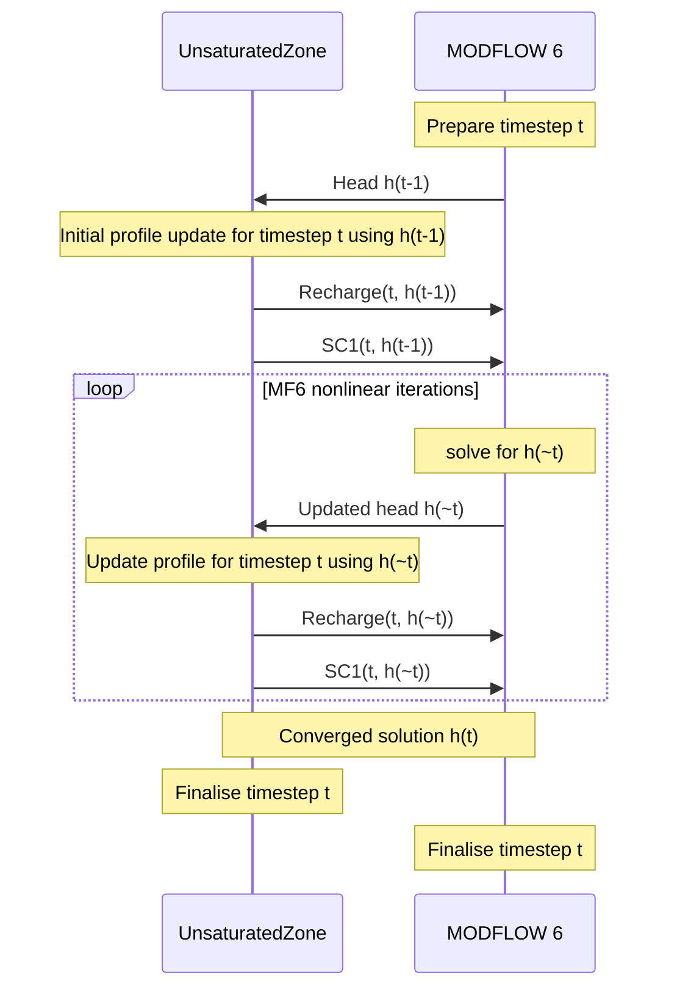

```mermaid

sequenceDiagram

    participant UZ as UnsaturatedZone
    participant MF6 as MODFLOW 6

    Note over MF6: Prepare timestep t

    MF6->>UZ: Head h(t-1)

    Note over UZ: Initial profile update for timestep t using h(t-1)

    UZ->>MF6: Recharge(t, h(t-1))
    UZ->>MF6: SC1(t, h(t-1))

    loop MF6 nonlinear iterations
        Note over MF6: solve for h(~t)

        MF6->>UZ: Updated head h(~t)

        Note over UZ: Update profile for timestep t using h(~t)

        UZ->>MF6: Recharge(t, h(~t))
        UZ->>MF6: SC1(t, h(~t))
    end

    Note over UZ,MF6: Converged solution h(t)

    Note over UZ: Finalise timestep t
    Note over MF6: Finalise timestep t


```

